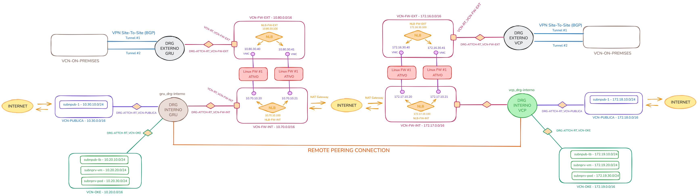

# OCI Pizza

A **OCI Pizza** é uma aplicação web baseada em microsserviços criada para estudo prático de:

- Oracle Cloud Infrastructure (OCI)
- Kubernetes
- Oracle Kubernetes Engine (OKE)
- Redes em cloud
- Terraform
- Arquitetura de software e infraestrutura

## Estrutura dos diretórios

### docs/

Documentação do projeto, incluindo arquitetura da aplicação, topologia de rede, diagramas de infraestrutura e descrição dos serviços.

### terraform/

Infraestrutura como código utilizada para provisionar os recursos no Oracle Cloud Infrastructure (OCI), incluindo redes, gateways, sub-redes e o cluster Kubernetes (OKE).

### services/

Código-fonte dos microsserviços da aplicação **OCI Pizza**, responsáveis pela implementação da lógica de negócio da plataforma.

## Topologia de Rede

## Serviços

Um serviço é um componente de software responsável por uma parte específica do domínio do sistema.

- [Auth Service - Autenticação de usuários](./services/auth.md)
- [Pizza Service - Catálogo de pizzas](./services/pizza.md)
- [User Service - Gerenciamento de usuários](./services/user.md)
- Order - Gerenciamento de pedidos
- Payment - Processamento de pagamentos